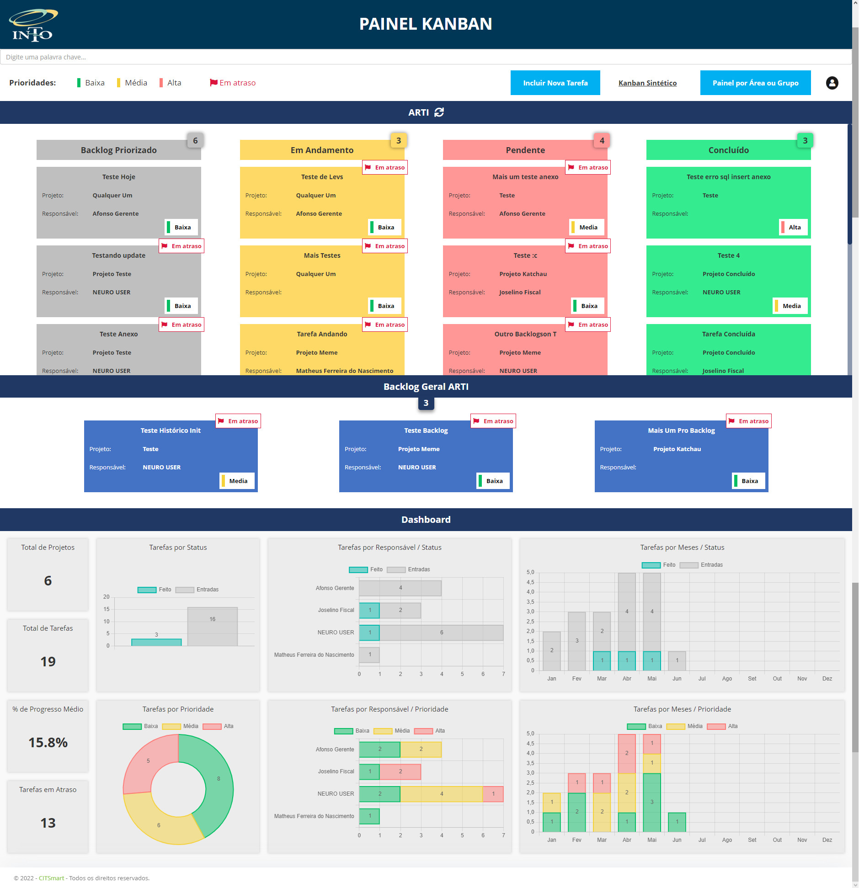

# Quadro Kanban - INTO

  

O projeto de um quadro kanban feito para o INTO. Nessa aplicação é possível gerenciar quadros, atividades e membros, com sistema de permissão por tipo de usuário. Conta também com drag and drop das atividades do quadro e com a exibição de dashboards com informações compiladas sobre o quadro. Nesse projeto utilizei: JavaScript, HTML, CSS, AngularJS, Postgres e Neuro.
  
Por ser feito dentro do sistema da empresa (Citsmart feat. Neuro), o código é versionado por lá, então vou usar esse repositório só como backup de alguns trechos mais importantes. Além disso, o próprio sistema faz algumas configurações por debaixo dos panos, como por exemplo algumas libs, AngularJS e a comunicação com o banco de dados, então o código por si só não vai funcionar. O máximo que dá pra fazer é deixar um preview de como ficou e torcer pra você confiar que tá funcionando certinho (e tá mesmo).
  
   
